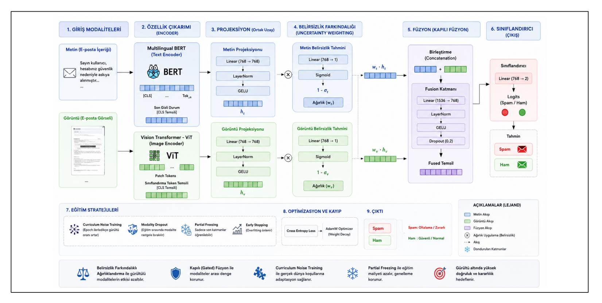
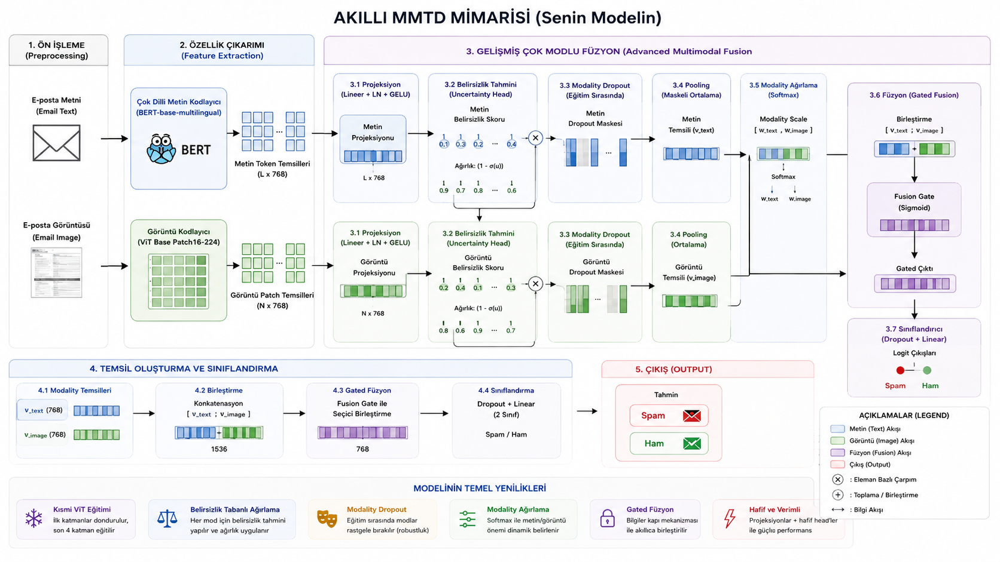

# Robust Multimodal Phishing Detection with Noise-Aware Gated Fusion

A research-oriented project focused on improving the robustness of multilingual and multimodal phishing detection systems under noisy real-world conditions.

This work extends the original MMTD architecture by exploring multiple multimodal fusion strategies and proposing a lightweight noise-aware fusion framework that improves robustness against corrupted image and text modalities.

---

## Motivation

Most multimodal phishing detection models achieve excellent performance on clean benchmark datasets but experience significant performance degradation when exposed to noisy, manipulated, or incomplete inputs.

This project investigates how different fusion architectures behave under noisy environments and proposes a more robust multimodal fusion strategy based on uncertainty-aware weighting and curriculum noise training.

---

## Research Evolution

The project was developed through several architectural iterations.

### Stage 1
- Symmetric Co-Attention
- Dynamic Gating

### Stage 2
- Asymmetric Cross-Attention
- Document Image Transformer (DiT)
- Modality Dropout

### Stage 3
- Confidence-Aware Fusion
- Hybrid Pooling
- Full Fine-tuning Optimization

### Final Architecture
- Uncertainty-Aware Weighting
- Lightweight Gated Fusion
- Late Fusion
- Curriculum Noise Training
- Robustness-Oriented Learning

---

## Final Architecture

<p align="center">

</p>

---

## Future Research Direction

<p align="center">

</p>

Future work focuses on extending the current architecture with more adaptive multimodal fusion strategies, stronger uncertainty estimation, and robustness against increasingly challenging phishing scenarios.

---

## Experimental Results

| Scenario | F1 Score |
|----------|---------:|
| Clean Data | **98.46%** |
| Image Noise | **98.22%** |
| Text Noise | **97.05%** |
| Full Chaos | **96.68%** |

The proposed architecture significantly reduces the performance gap between clean and noisy evaluation settings while maintaining high overall accuracy.

---

## Kaggle Experiments

The complete experimental notebooks are available on Kaggle.

| Experiment | Notebook |
|------------|----------|
| Symmetric Co-Attention | https://www.kaggle.com/code/arafkubraa/notebook31d87a2a30 |
| Asymmetric Cross-Attention | https://www.kaggle.com/code/arafkubraa/asimetrik |
| Confidence-Aware Fusion | https://www.kaggle.com/code/arafkubraa/confidence |
| Robustness Evaluation | https://www.kaggle.com/code/arafkubraa/robustnesstest |

---

## Project Structure

```
Robust-Multimodal-Phishing-Detection
│
├── README.md
├── figures/
├── notebooks/
└── src/
```

---

## Research Contributions

- Robust multilingual and multimodal phishing detection
- Investigation of multiple multimodal fusion strategies
- Asymmetric Cross-Attention experiments
- Confidence-aware multimodal fusion
- Uncertainty-aware weighting mechanism
- Curriculum Noise Training
- Comprehensive robustness evaluation under noisy conditions
- Ablation studies

---

## Acknowledgements

This project is based on the original **MMTD (Multilingual and Multimodal Spam Detection)** framework and extends it with robustness-oriented multimodal learning techniques.

Original implementation:
https://github.com/RIA-lab/MMTD

---


## Authors

- Kübra Atlan
- Gamze Kızıl
- Emir Söylemez

Karadeniz Technical University  
Department of Computer Engineering

---

## License

This repository is intended for research and educational purposes.
